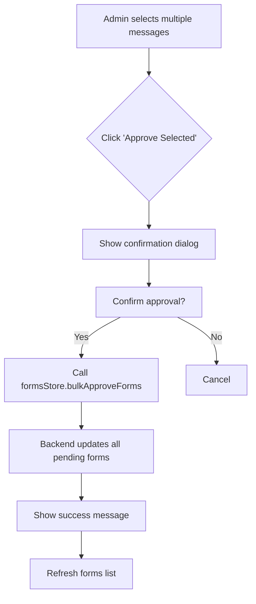
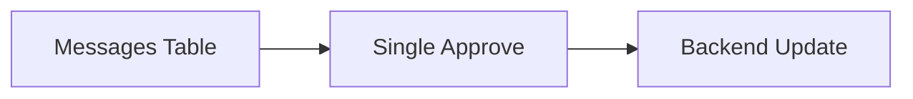
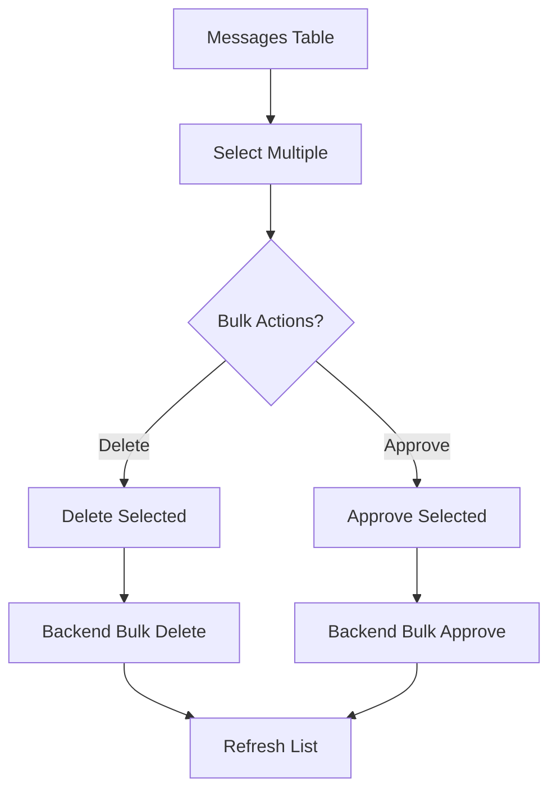

# Bulk Approve Messages Implementation Plan

## Overview

Add bulk approve functionality to the Admin Messages page (`/admin/messages`) to allow admins to approve multiple pending messages at once.

## Current State

- **Frontend**: `fe/src/components/Admin/CommunicationRecords/Messages.vue`
  - Already has bulk delete functionality
  - Already has selection UI with checkboxes
  - Already has single approve functionality
- **Backend**: `be/routes/formRoutes.js`
  - Has single form update endpoint
  - Has bulk delete endpoint
- **Store**: `fe/src/stores/formsStore.js`
  - Has `approveForm(formId)` method
  - Has `bulkDeleteForms(formIds)` method

## Implementation Steps

### Step 1: Add Backend Bulk Approve Endpoint

**File**: `be/routes/formRoutes.js`

Add new endpoint:

```javascript
/**
 * BULK APPROVE FORMS - Approve multiple forms at once
 * PUT /api/forms/bulkApproveForms
 * Body: { form_ids: [1, 2, 3] }
 */
router.put("/bulkApproveForms", async (req, res) => {
  try {
    const { form_ids } = req.body;
    // Validate input
    // Call bulkApproveForms helper
    // Return results
  } catch (error) {
    // Handle errors
  }
});
```

**File**: `be/dbHelpers/formRecords.js`

Add helper function:

```javascript
async function bulkApproveForms(formIds, reviewedBy) {
  try {
    // Update all forms with status 'approved' where form_id in (formIds)
    // Only update forms with status 'pending'
    // Return success count
  } catch (error) {
    throw error;
  }
}
```

### Step 2: Add Frontend Store Method

**File**: `fe/src/stores/formsStore.js`

Add new action:

```javascript
async bulkApproveForms(formIds) {
  try {
    const response = await axios.put('/forms/bulkApproveForms', { form_ids: formIds });
    // Update local state
    // Refresh forms list
    return { success: true, ... };
  } catch (error) {
    throw error;
  }
}
```

### Step 3: Update Frontend Component

**File**: `fe/src/components/Admin/CommunicationRecords/Messages.vue`

1. Add "Approve Selected" button to bulk actions row (line 110-145)
2. Add `bulkApproveForms` function to handle bulk approval
3. Update confirmation dialog to show count of selected forms



## Mermaid Diagram - Current vs New Flow

### Current Flow



### New Flow with Bulk Approve



## Files to Modify

1. `be/routes/formRoutes.js` - Add bulkApproveForms endpoint
2. `be/dbHelpers/formRecords.js` - Add bulkApproveForms helper
3. `fe/src/stores/formsStore.js` - Add bulkApproveForms action
4. `fe/src/components/Admin/CommunicationRecords/Messages.vue` - Add UI and handlers

## API Changes

### New Endpoint

```
PUT /api/forms/bulkApproveForms
Body: { form_ids: [1, 2, 3] }
Response: { success: true, message: "X forms approved", data: { approved: 3, skipped: 1 } }
```

## Frontend UI Changes

- Add "Approve Selected" button next to "Delete Selected" in bulk actions row
- Button disabled when no forms selected or no pending forms selected
- Confirmation dialog shows: "Are you sure you want to approve X pending forms?"
