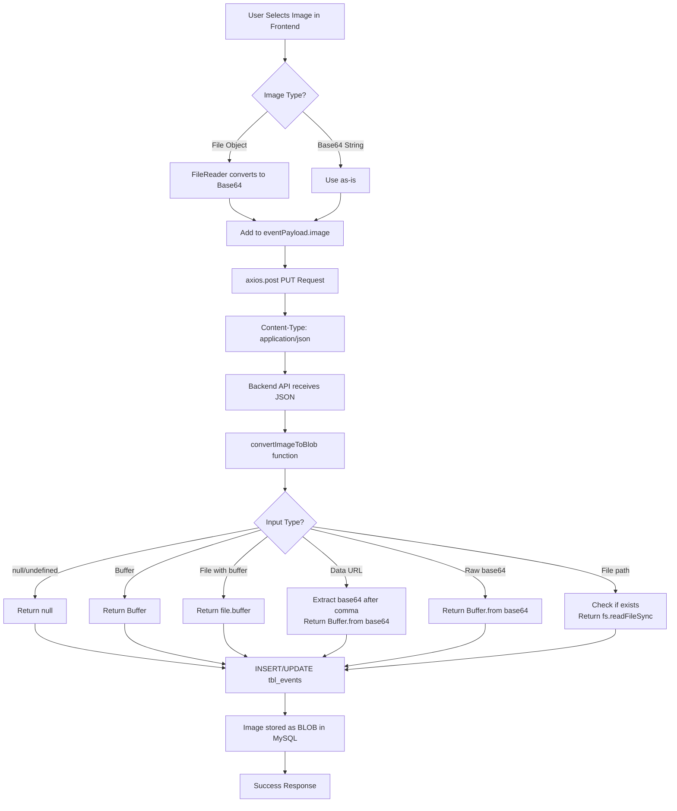
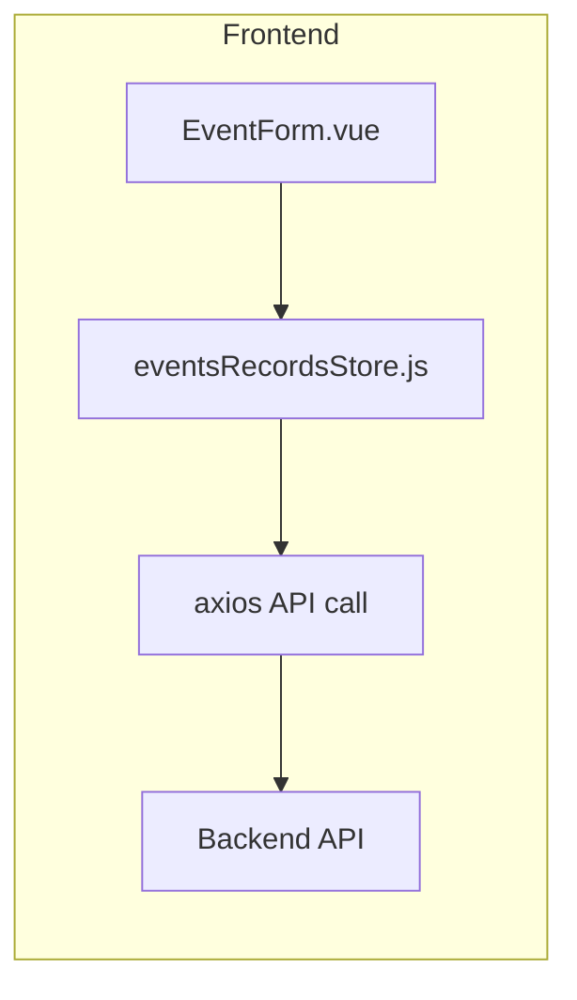
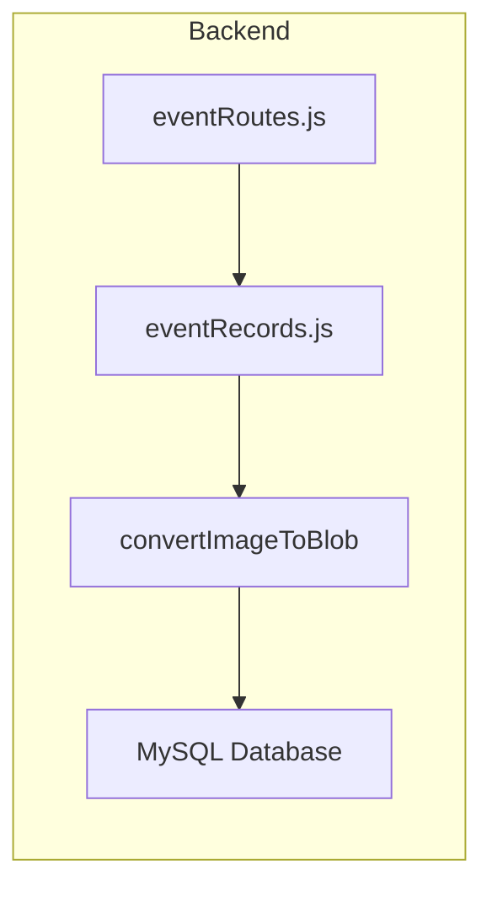
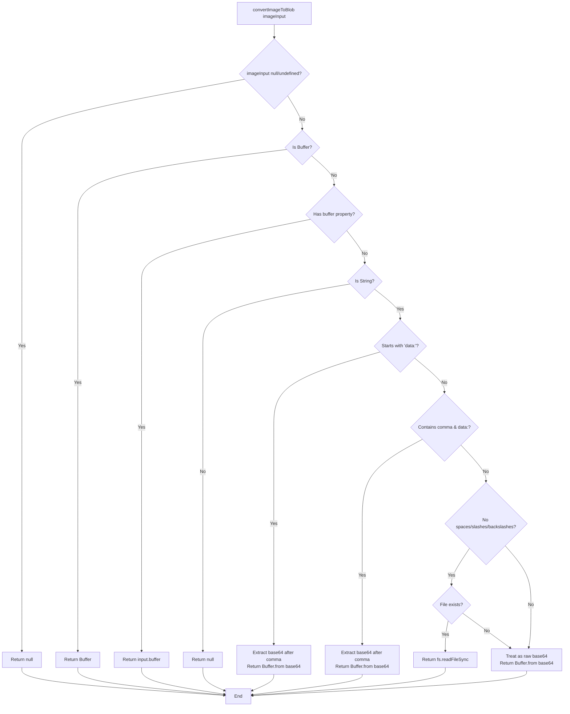
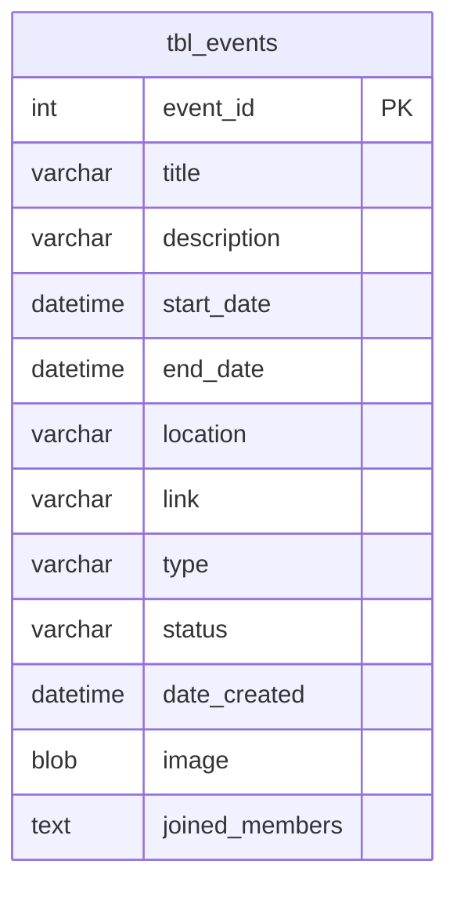
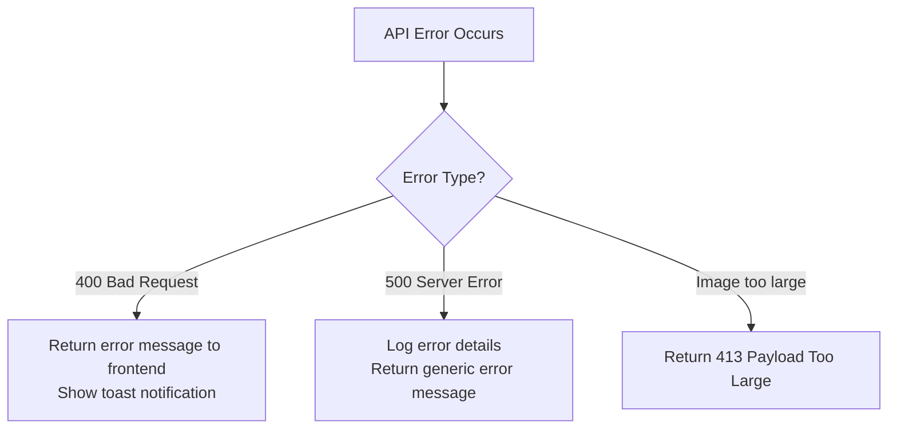

# Events Image Processing Flowchart

## Overview

This document describes the complete flow of image processing when creating or updating events in the Church Management System.

## Component Details

### Frontend Flow

### Backend Flow

## convertImageToBlob Logic

## Database Schema

## API Endpoints

| Method | Endpoint                                 | Description           |
| ------ | ---------------------------------------- | --------------------- |
| POST   | `/church-records/events/createEvent`     | Create new event      |
| PUT    | `/church-records/events/updateEvent/:id` | Update existing event |

## Error Handling

## Common Issues & Solutions

1. **400 API Error** - Fixed: Typo in variable name (`image64Input` → `imageInput`)
2. **Images not saving** - Fixed: Proper base64 data URL detection
3. **Base64 string with data URL prefix** - Parse correctly by splitting on comma
4. **Raw base64 strings** - Handle without data URL prefix
