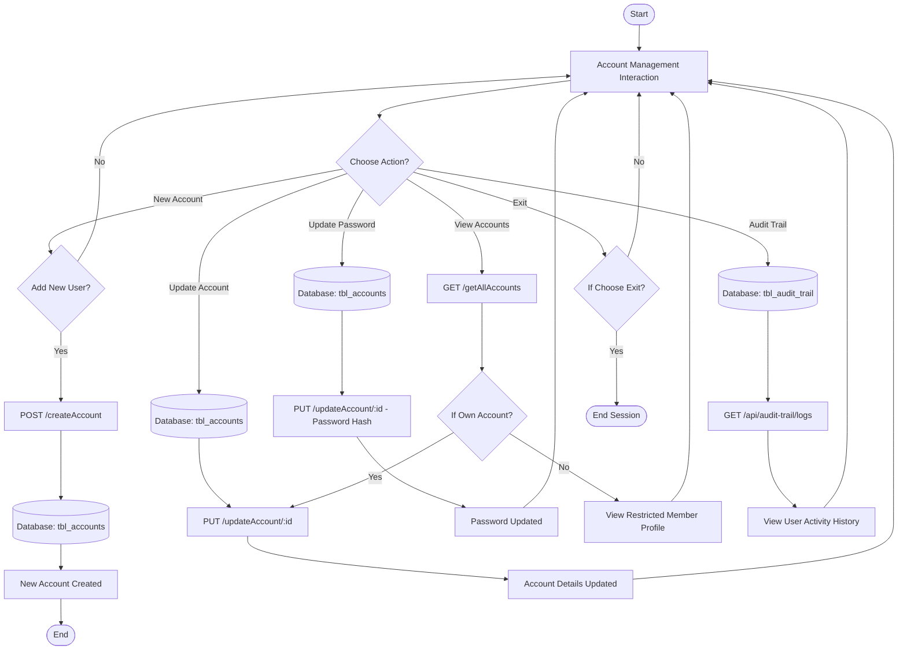
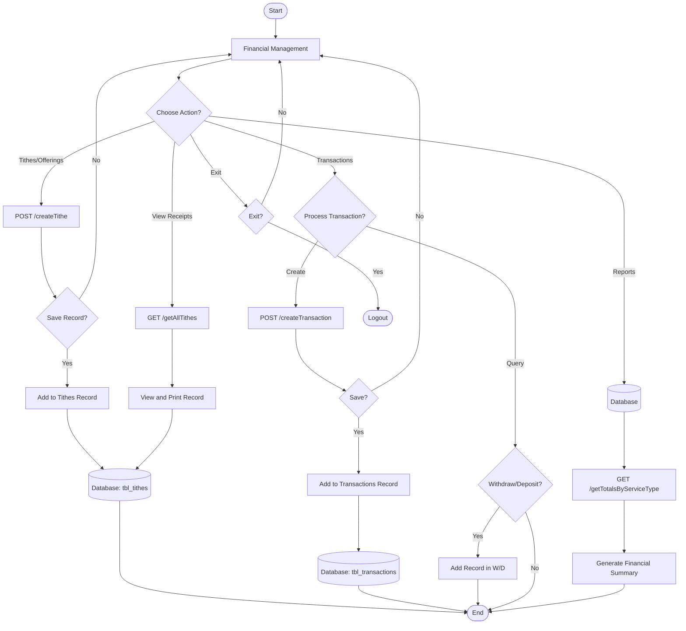
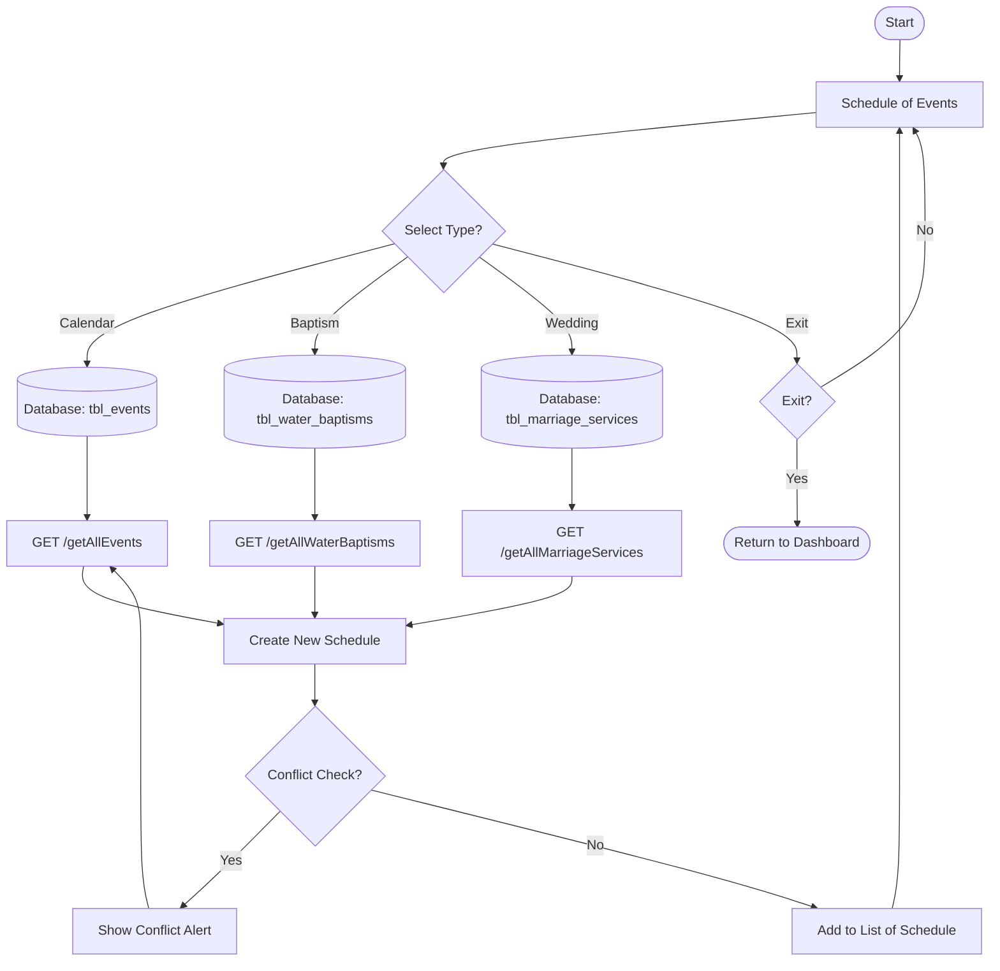
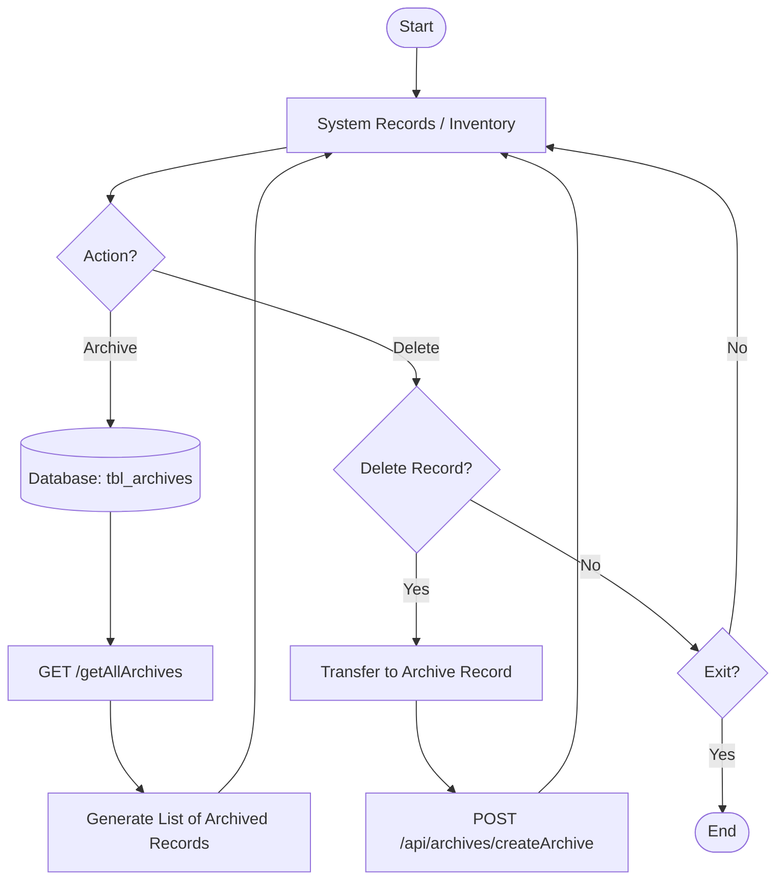
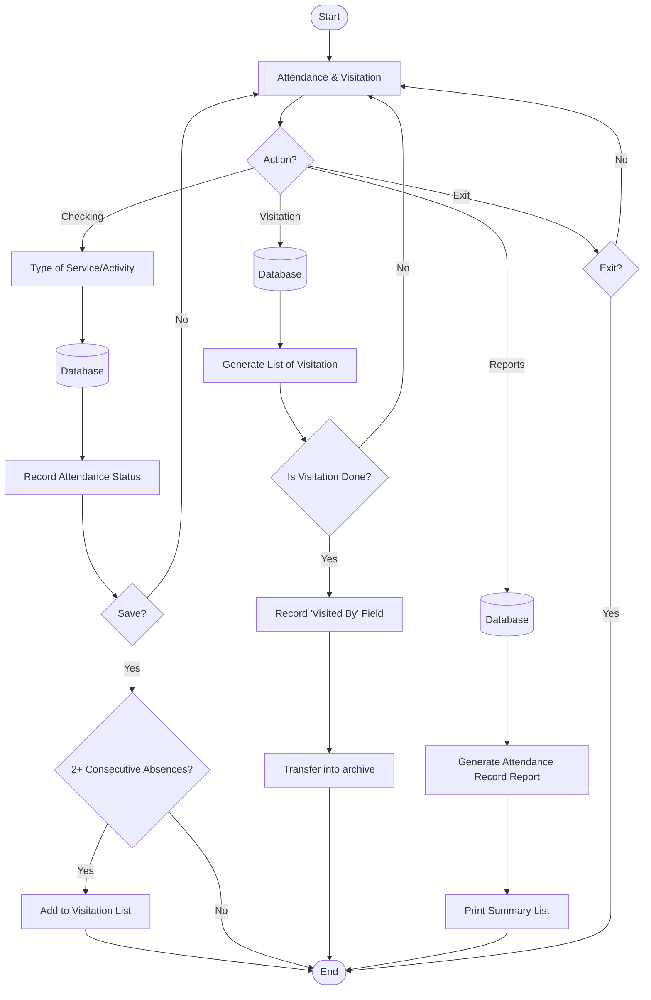

# System Flowcharts - BBEK Application

This document provides a comprehensive set of flowcharts for the BBEK system, designed to match the logic of the actual codebase while following the visual and structural patterns provided in your examples.

## 1. Account Management Flow
This flow covers user authentication, account creation, updates, and the audit trail.
> [!NOTE]
> Mapped to `accountRoutes.js` and `auditTrailRoutes.js`.

---

## 2. Financial Management Flow
Handles tithes, offerings, and general transactions.
> [!NOTE]
> Mapped to `tithesRoutes.js` and `transactionRoutes.js`.

---

## 3. Schedule of Events Flow
Includes coordination for Baptisms, Weddings, and general Church Calendar events.
> [!NOTE]
> Mapped to `eventRoutes.js`, `waterBaptismRoutes.js`, and `marriageServiceRoutes.js`.

---

## 4. Inventory & Archive Flow
While the system primarily uses Archive for record preservation, this flow represents the management of system records.
> [!NOTE]
> Mapped to `archiveRoutes.js`.

---

## 5. Attendance & Visitation Flow (Integrated Plan)
This flow models the attendance logic integrated with member engagement and visitation trigger alerts.

