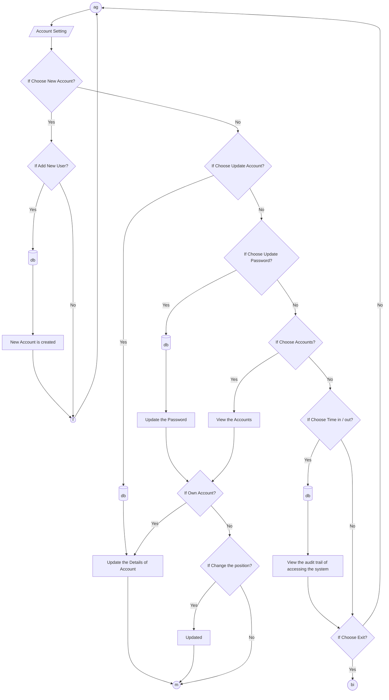
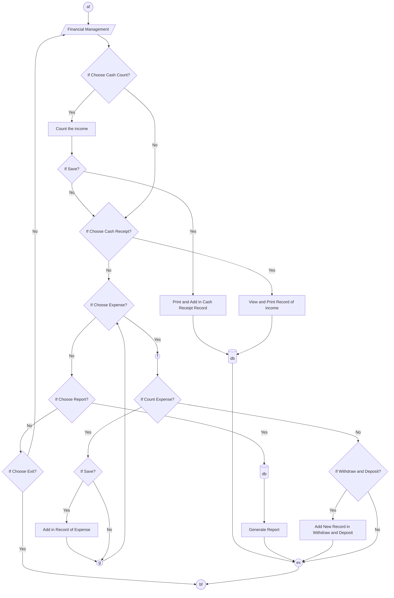
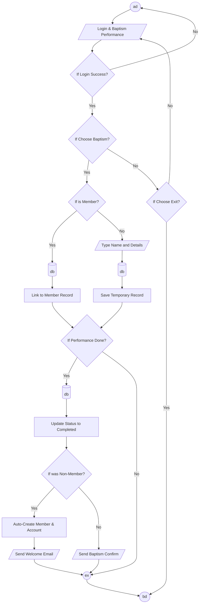

# Traditional Flowcharts - BBEK Application

Here is the traditional-style flowchart code for the BBEK system. You can copy these blocks into the [Mermaid Live Editor](https://mermaid.live/).

## 1. Account Management Flow

## 2. Financial Management Flow

## 3. Login to Baptism Performance Flow

